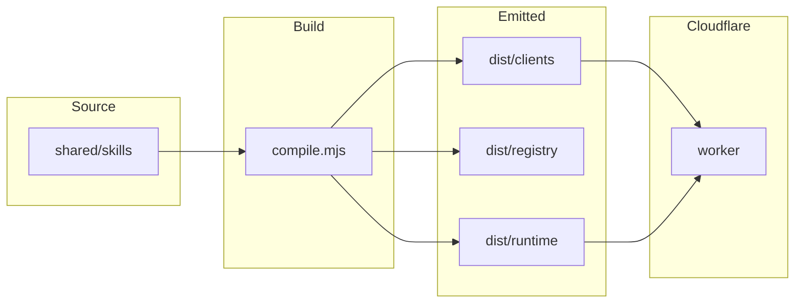

# AI Config OS

**Build a personal AI behaviour layer for Claude Code and other agents.**

[Build and Validate Skills](https://github.com/thomashillman/ai-config-os/actions/workflows/build.yml)
[License](https://github.com/thomashillman/ai-config-os)

_Additional CI:_ [Validate plugin structure](.github/workflows/validate.yml) runs when paths such as `shared/skills/`, `plugins/`, `runtime/`, and related trees change — not on every commit to `main`.

AI Config OS is a plugin marketplace and skill authoring system that centralizes how you configure AI agents across your devices. Instead of scattering prompts, hooks, and conventions across different tools, you define them once in a shared library and deploy them everywhere—your Claude Code workspace, Cursor, Codex, or any tool that supports plugins.

Skills follow the [Agent Skills](https://agentskills.io) open standard — a portable format implemented by many agent products. This repo extends the standard with multi-model variants, capability contracts, automated testing, and cross-platform distribution. See `[docs/SKILLS.md](docs/SKILLS.md)` for the comprehensive skills reference.

**Support status (canonical):** For what is supported _today_ (platforms, marketplace vs sync, dashboard features), see `**[docs/SUPPORTED_TODAY.md](docs/SUPPORTED_TODAY.md)`\*\*. Roadmap and milestones live in `[PLAN.md](PLAN.md)`.

## Table of contents

- [What you can do](#what-you-can-do)
- [Quick start](#quick-start)
- [Demo: local dashboard](#demo-local-dashboard)
- [Architecture](#architecture)
- [Configuration](#configuration)
- [Installation and setup by platform](#installation-and-setup-by-platform)
- [How to use](#how-to-use)
- [Runtime config and sync](#runtime-config-and-sync)
- [Directory structure](#directory-structure)
- [Examples: common tasks](#examples-common-tasks)
- [Status and roadmap](#status-and-roadmap)
- [Troubleshooting](#troubleshooting)
- [Versioning](#versioning)
  - [Release history](#release-history)
- [Testing and quality checks](#testing-and-quality-checks)
- [Contributing](#contributing)
- [Maintainers and contact](#maintainers-and-contact)
- [Security](#security)
- [License](#license)
- [Acknowledgements](#acknowledgements-and-related-projects)
- [Quick links](#quick-links)

## What you can do

- **Centralize AI behaviour:** Define skills, hooks, and conventions in one place; distribute compiled packages and (for Claude Code) refresh manifests from the Worker where configured.
- **Author skills that understand themselves:** Skills include metadata (inputs, outputs, dependencies, tests) so agents can discover and compose them.
- **Multi-model intelligence:** Tag skills with model variants (Opus, Sonnet, Haiku) and let the client pick the best match.
- **Visualize your setup:** A React dashboard surfaces tools, skills, context cost, and related runtime views (see `[docs/SUPPORTED_TODAY.md](docs/SUPPORTED_TODAY.md)` for the exact tab list).
- **Desired-state configuration:** Merge global, machine, and project YAML; sync applies **config and status** (including MCP config and CLI **presence checks**). Runtime sync **does not install** CLIs or IDEs — see [Runtime config and sync](#runtime-config-and-sync).

This is for you if you spend time in Claude Code, Cursor, or other agent IDEs, and want consistency without repetition.

## Quick start

**Prerequisites**

- **Node.js** 18+ (`[package.json](package.json)` `engines.node`: `>=18.0.0`) for builds, MCP, and dashboard
- **git** for clone and hooks
- **yq** for config merge (`brew install yq` / `snap install yq`)
- **jq** (optional; some adapter scripts)
- **Claude Code** if you use the marketplace plugin flow and `adapters/claude/` scripts

**Develop from source (repository root)**

```bash
cd /path/to/ai-config-os
npm ci   # or: npm install
npm run build
npm test
```

A successful run exits with code **0** and ends with a test summary (pass counts from the Node test runner). If anything fails, the process exits non-zero and the failing suite is named in the output.

**Install the Claude Code plugin (marketplace)**

```bash
git clone https://github.com/thomashillman/ai-config-os.git ~/ai-config-os
# In Claude Code: Plugins → Add Marketplace → repo URL → install "core-skills"
```

**Verify packaging and skills**

```bash
bash adapters/claude/dev-test.sh
```

You should see “All validation stages passed ✓” before relying on emitted `dist/` output.

## Demo: local dashboard

There is no checked-in screenshot in `docs/`; run the stack locally to see the UI.

**Manual two-terminal flow**

```bash
bash runtime/mcp/start.sh &
cd dashboard && npm ci && npm run dev
# Open http://localhost:5173
```

**One command (repo root)**

```bash
bash ops/dashboard-start.sh
```

This frees ports **4242** and **5173** (any listener on those ports — not only this repo), starts MCP + dashboard API, optionally publishes Worker KV snapshots, and starts Vite on **127.0.0.1:5173**. Requires `**curl`** and `**lsof`**. Set `VITE_WORKER_URL`and`VITE_AUTH_TOKEN`in`[dashboard/.env.local](dashboard/.env.local)`. For Skill Library and other snapshot-backed tabs, install `**yq`** so publish can run; otherwise run `node runtime/publish-dashboard-state.mjs` after installing `yq`.

**Security note:** The dashboard API denies non-loopback callers unless tunnel assertions match (`X-Tunnel-Token`, trusted forwarding headers, or optional mTLS). Configure `TUNNEL_SHARED_TOKEN`, `TRUSTED_FORWARDER_IPS`, `DASHBOARD_PUBLIC_ORIGINS`, and `REQUIRE_TUNNEL_MTLS=1` as needed.

## Architecture

AI Config OS follows a **portability contract**:

1. **Source:** Skills live in `shared/skills/` as self-contained `SKILL.md` files with metadata.
2. **Build:** `[scripts/build/compile.mjs](scripts/build/compile.mjs)` validates and emits self-sufficient packages under `dist/clients/<platform>/`.
3. **Distribution:** Emitted packages have no symlinks to source and no source-tree references in normal builds.
4. **Materialisation:** Packages can be extracted and materialised offline (see adapters and materialiser).



### Runtime execution (Phase 1, Cloudflare-first)

Phase 1 needs no external executor host.

1. **Main Worker** (`worker/src/`) — API gateway for artifacts and routing.
2. **Executor Worker** (`worker/executor/`) — Phase 1 tools via service binding (KV/R2 metadata, bounded timeout).
3. **Task control plane** (`runtime/lib/`) — Portable tasks, routes, continuation.

Workers talk via **service bindings** (not public HTTP between them).

**Supporting components**

- `runtime/mcp/` — Local MCP server (runtime + dashboard API).
- `runtime/remote-executor/` — Phase 0 HTTP executor seam (preserved for a possible Phase 2; not the primary path).
- `dashboard/` — Operator UI over the runtime API.

**Phase 2 (not implemented):** A future VPS-backed executor may add shell, filesystem, git, and long-running tasks. The seam exists in code; Phase 1 remains the fast path for metadata operations.

### Current product state (summary)

Portable tasks (including `review_repository`), Momentum Engine (narrator, observer, shelf, lexicon, reflector), and KV-backed task persistence (`runtime/lib/task-store-kv.mjs`) are implemented. Session-start hooks can query the Worker for active tasks. For operational validation notes and acceptance criteria, see `[PLAN.md](PLAN.md)` and `[specs/](specs/)`.

## Configuration

| Item                                                                                              | Purpose                                                          |
| ------------------------------------------------------------------------------------------------- | ---------------------------------------------------------------- |
| `AI_CONFIG_TOKEN`                                                                                 | Bearer token for Worker API calls from adapters and hooks        |
| `AI_CONFIG_WORKER`                                                                                | Base URL of the Worker (e.g. `https://ai-config-os.workers.dev`) |
| `VITE_WORKER_URL`, `VITE_AUTH_TOKEN`                                                              | Dashboard client → Worker (`dashboard/.env.local`)               |
| `DASHBOARD_PUBLIC_ORIGINS`, `TUNNEL_SHARED_TOKEN`, `TRUSTED_FORWARDER_IPS`, `REQUIRE_TUNNEL_MTLS` | Tunnel / CORS / hardening for dashboard API                      |

Deploy your own Worker (optional):

```bash
cd worker
wrangler secret put AUTH_TOKEN
wrangler deploy
```

Verify reachability:

```bash
curl -H "Authorization: Bearer $AI_CONFIG_TOKEN" \
  "$AI_CONFIG_WORKER/v1/manifest/latest" | head -50
```

## Installation and setup by platform

Summary table (see `[docs/SUPPORTED_TODAY.md](docs/SUPPORTED_TODAY.md)` for evidence and nuance):

| Surface                                          | Setup                                                                                                                               | Offline skills cache              | Runtime sync role                                                                                                                              |
| ------------------------------------------------ | ----------------------------------------------------------------------------------------------------------------------------------- | --------------------------------- | ---------------------------------------------------------------------------------------------------------------------------------------------- |
| **Claude Code** (local/remote)                   | Marketplace + env + `adapters/claude/materialise.sh`                                                                                | Yes (`~/.ai-config-os/cache/...`) | Full sync/status for `claude-code` in registry; MCP + CLI checks                                                                               |
| **Cursor**                                       | `npm run build` + copy `dist/clients/cursor/skills/` to `~/.cursor/skills` or project                                               | N/A (local copy)                  | Registry + CLI presence; file-adapter sync mostly no-op today                                                                                  |
| **Codex**                                        | Build + `[adapters/codex/install.sh](adapters/codex/install.sh)` / `[adapters/codex/materialise.sh](adapters/codex/materialise.sh)` | Per your install                  | Presence checks; no installer inside `runtime/sync.sh`                                                                                         |
| **Other IDEs (VS Code, JetBrains, Windsurf, …)** | No `dist/clients/`\* package from this compiler today                                                                               | N/A                               | May appear in `[shared/targets/platforms/](shared/targets/platforms/)` for compatibility only; use Claude Code / Cursor / Codex emitters above |

**Claude Code CLI (local)**

**Best for:** Local development, terminal-first workflow, offline usage.

1. Obtain Worker credentials (shared deployment or your own — see [Configuration](#configuration)).
2. Set `AI_CONFIG_TOKEN` and `AI_CONFIG_WORKER` in your environment (replace placeholders with your real token and Worker base URL).

#### bash / zsh

```bash
# Add to ~/.bashrc, ~/.zshrc, or ~/.bash_profile
export AI_CONFIG_TOKEN="<your-token-here>"
export AI_CONFIG_WORKER="https://ai-config-os.workers.dev"
source ~/.zshrc   # or: source ~/.bashrc
```

#### fish

```fish
# Add to ~/.config/fish/config.fish
set -gx AI_CONFIG_TOKEN "<your-token-here>"
set -gx AI_CONFIG_WORKER "https://ai-config-os.workers.dev"
source ~/.config/fish/config.fish
```

#### PowerShell

```powershell
[Environment]::SetEnvironmentVariable("AI_CONFIG_TOKEN", "<your-token-here>", "User")
[Environment]::SetEnvironmentVariable("AI_CONFIG_WORKER", "https://ai-config-os.workers.dev", "User")
# Open a new PowerShell window so User-scoped variables apply.
```

1. Fetch and cache skills:

```bash
bash adapters/claude/materialise.sh
bash adapters/claude/materialise.sh status
```

**Offline:** Cache path `~/.ai-config-os/cache/claude-code/latest.json`. If the Worker is unreachable, hooks can fall back to last-known-good where implemented.

**Claude Code CLI (remote: Codespaces, SSH, CI agents)**

Set `AI_CONFIG_TOKEN` and `AI_CONFIG_WORKER` in the environment (e.g. Codespace secrets). Session-start behaviour validates skills, probes capabilities, refreshes manifest in the background when possible, and falls back to cache when offline.

Stress-test cache behaviour:

```bash
rm ~/.ai-config-os/cache/claude-code/latest.json
bash adapters/claude/materialise.sh status
bash adapters/claude/materialise.sh
```

**Claude.ai web (browser)**

**Not supported** for the skill system today — capability modeling only. Use Claude Code in a remote environment if you need cloud access.

**Cursor IDE**

```bash
npm run build
npm run check:cursor-rules   # if you use .cursor/rules/*.mdc
mkdir -p ~/.cursor/skills
cp -R /path/to/ai-config-os/dist/clients/cursor/skills/* ~/.cursor/skills/
# Or copy into <repo>/.cursor/skills/
```

Restart Cursor. Skills are discovered under Agent Skills paths — not by pointing Settings only at `dist/clients/cursor/` root. Optional: `AI_CONFIG_OS_EMIT_CURSORRULES=1 npm run build` for legacy `.cursorrules` migration.

```bash
bash adapters/claude/dev-test.sh
```

Docs: [Cursor Agent Skills](https://cursor.com/docs/context/skills).

**VS Code, JetBrains, Windsurf, and other modeled surfaces**

The compiler **only** emits installable trees under `dist/clients/claude-code`, `dist/clients/cursor`, and `dist/clients/codex` (see `[scripts/build/compile.mjs](scripts/build/compile.mjs)` and `[docs/SUPPORTED_TODAY.md](docs/SUPPORTED_TODAY.md)`). There is **no** `dist/clients/vscode`, `jetbrains`, or `windsurf` output from `npm run build`.

## How to use

### Running a skill in Claude Code

Use the skill picker / task flow your Claude Code build exposes; metadata in each `SKILL.md` describes inputs and outputs.

### Adding your own skill

```bash
node scripts/build/new-skill.mjs my-skill
# Edit shared/skills/my-skill/SKILL.md; update shared/manifest.md
bash adapters/claude/dev-test.sh
```

**Skill metadata (excerpt)** — standard fields follow [Agent Skills](https://agentskills.io/specification); this repo adds `type`, `capabilities`, `inputs`, `outputs`, `dependencies`, `variants`, `tests`, etc. See `[shared/skills/_template/SKILL.md](shared/skills/_template/SKILL.md)` and `[docs/SKILLS.md](docs/SKILLS.md)`.

### Develop in this repository

Open the repo in your editor; `[CLAUDE.md](CLAUDE.md)` and `[AGENTS.md](AGENTS.md)` carry checklists and conventions.

## Runtime config and sync

`runtime/sync.sh` merges **global → machine → project** YAML, updates manifest status, syncs **MCP server config** (`~/.claude/mcp.json` via the MCP adapter), and runs **CLI presence checks**. It does **not** install missing CLIs or IDEs (`runtime/adapters/cli-adapter.sh` reports “no installation performed”). File-based tool sync is **limited / mostly no-op** today (`runtime/adapters/file-adapter.sh`).

```bash
vim runtime/config/global.yaml
vim runtime/config/machines/laptop.yaml
vim runtime/config/project.yaml
bash runtime/sync.sh --dry-run
bash runtime/sync.sh
bash ops/runtime-status.sh
```

Optional watch: `bash runtime/watch.sh`.

Installers for some surfaces exist as **separate scripts** (e.g. `[adapters/cursor/install.sh](adapters/cursor/install.sh)`, `[adapters/codex/install.sh](adapters/codex/install.sh)`) — they are not invoked automatically by `runtime/sync.sh`.

## Directory structure

| Path                       | Purpose                                                                           |
| -------------------------- | --------------------------------------------------------------------------------- |
| `**shared/skills/`\*\*     | Canonical skill source (`SKILL.md` per folder). Compiler reads only this tree.    |
| `**dist/clients/`\*\*      | Emitted per-platform packages (self-contained).                                   |
| `**dist/registry/`\*\*     | Cross-platform `index.json` and summaries.                                        |
| `**dist/runtime/**`        | Task routes, tool registry snapshots, manifests consumed by Worker/MCP/dashboard. |
| `shared/workflows/`        | Composed workflows (JSON).                                                        |
| `shared/targets/`          | Platform capability YAML.                                                         |
| `shared/lib/`              | Shared libraries (YAML, analytics, merger).                                       |
| `schemas/`                 | JSON Schemas for manifests and related types.                                     |
| `scripts/build/`           | Compiler, materialiser, tests.                                                    |
| `worker/`                  | Cloudflare Worker + executor subtree.                                             |
| `plugins/core-skills/`     | Claude plugin metadata (optional dev symlinks on Unix).                           |
| `runtime/config/`          | Merged desired-state YAML.                                                        |
| `runtime/adapters/`        | Claude, Cursor, Codex, MCP, file, CLI adapters.                                   |
| `runtime/mcp/`             | MCP server + dashboard API.                                                       |
| `runtime/remote-executor/` | Legacy HTTP executor seam.                                                        |
| `runtime/lib/`             | Task control plane + Momentum components.                                         |
| `dashboard/`               | React SPA.                                                                        |
| `ops/`                     | Validation, dashboard orchestration, helpers.                                     |
| `.claude/hooks/`           | Claude Code hooks.                                                                |
| `.github/workflows/`       | CI (`build.yml`, `validate.yml`, PR gates).                                       |

**Worker TypeScript:** `npm install` at repo root; `npm run check:worker-types`; with worker deps, `npm run check:worker-test-types` under `worker/`.

## Examples: common tasks

### Merge open PRs (sequential)

```bash
bash ops/merge-open-prs.sh
```

### Scaffold a skill

```bash
ops/new-skill.sh security-scan
# Edit shared/skills/security-scan/SKILL.md; add tests if needed
bash adapters/claude/dev-test.sh
```

### Workflow: daily brief

See `[shared/workflows/daily-brief.json](shared/workflows/daily-brief.json)`. Others: `pre-commit`, `code-quality`, `release-agent`, `research-mode` under `shared/workflows/`.

## Status and roadmap

| Phase              | Status   | Notes                                                                                                                     |
| ------------------ | -------- | ------------------------------------------------------------------------------------------------------------------------- |
| Phase 1–7          | Complete | Skill library, metadata, tests, composition — `[shared/manifest.md](shared/manifest.md)`                                  |
| Phase 8            | Complete | Runtime config, MCP, dashboard, sync                                                                                      |
| Phase 9.1–9.7      | Complete | Compiler, distribution, capability contracts, delivery/portability tests                                                  |
| Phase 10 milestone | Complete | KV tasks, Codex emitter, Tasks UI, Momentum Engine, portable task skills — see `[shared/manifest.md](shared/manifest.md)` |

Versioning: repository release is `./VERSION`; phase labels are internal checkpoints.

`Installable skill count: 39 (source: shared/skills/*/SKILL.md; excluding _template).`

**Platform maturity**

| Platform               | Compiler                    | Worker               | Runtime sync (today)                                                              | Notes                                       |
| ---------------------- | --------------------------- | -------------------- | --------------------------------------------------------------------------------- | ------------------------------------------- |
| Claude Code            | Full emitter                | Serves latest bundle | Registry + MCP + CLI checks                                                       | Primary production path                     |
| Cursor                 | Emits `dist/clients/cursor` | Not served as bundle | Registry + CLI checks; file sync mostly no-op                                     | Install skills by copy; see SUPPORTED_TODAY |
| Codex                  | Emits Codex package         | Not served           | Presence checks; `[adapters/codex/materialise.sh](adapters/codex/materialise.sh)` | No Worker-side Codex bundle                 |
| claude-web, claude-ios | Modeled                     | Not served           | N/A                                                                               | Compatibility / model only                  |

## Troubleshooting

**Validation / structure**

```bash
bash adapters/claude/dev-test.sh
```

**Sync / status**

```bash
bash runtime/sync.sh --dry-run
bash ops/runtime-status.sh
```

**Version drift**

- Bump `./VERSION`, then `npm run version:sync` and `npm run version:check`.
- `ops/new-skill.sh` does not bump the release version.

## Versioning

- `./VERSION` is canonical; `package.json` and `plugins/core-skills/.claude-plugin/plugin.json` track it via `npm run version:sync`.
- Per-skill versions live in each skill’s frontmatter.
- Local builds are deterministic; release builds may add provenance (`--release`).

### Release history

- Tagged releases and notes: [GitHub Releases](https://github.com/thomashillman/ai-config-os/releases).
- Not every commit is tagged; use `git log --oneline --decorate` for full history.
- The current value in `[VERSION](VERSION)` is the repository release number (for example `0.6.4` at time of writing).

## Testing and quality checks

| Command                                                          | When                                         |
| ---------------------------------------------------------------- | -------------------------------------------- |
| `npm run build`                                                  | Compile skills to `dist/`                    |
| `npm test`                                                       | Full test suite (runs compile via `pretest`) |
| `npm run validate`                                               | Compile validation only                      |
| `npm run format:check`                                           | Prettier (CI-enforced)                       |
| `npm run check:cursor-rules`                                     | After editing `.cursor/rules/*.mdc`          |
| `npm run doctrine:check`                                         | After editing `shared/agent-doctrine/`\*\*   |
| `npm run check:worker-types` / `npm run check:worker-test-types` | Worker TypeScript                            |
| `bash ops/validate-all.sh`                                       | Broader ops validation                       |
| `bash adapters/claude/dev-test.sh`                               | Plugin and packaging checks                  |

Narrow tests: `npm run test:file -- scripts/build/test/<name>.test.mjs` (run `npm run build` first if you need fresh `dist/`).

Full agent checklists: `[AGENTS.md](AGENTS.md)`, `[CLAUDE.md](CLAUDE.md)`.

## Contributing

1. Fork and branch (e.g. `git checkout -b feat/my-change`).
2. `npm ci` at repo root.
3. Make changes; run the [Testing and quality checks](#testing-and-quality-checks) relevant to your edit.
4. Use [Conventional Commits](https://www.conventionalcommits.org/).
5. Open a PR.

There is no separate `CONTRIBUTING.md` in this repo — this section is the contribution entrypoint.

**Skills:** Prefer multi-model variants where applicable, tests or fixtures per skill conventions, and update `[shared/manifest.md](shared/manifest.md)`.

## Maintainers and contact

- **Repository:** [thomashillman/ai-config-os](https://github.com/thomashillman/ai-config-os) on GitHub.
- **General questions and bug reports:** [GitHub Issues](https://github.com/thomashillman/ai-config-os/issues).
- **Security-sensitive reports:** use a private channel — see [Security](#security) (for example GitHub Security advisories where available).

## Security

Do not report security-sensitive issues in public issues if you believe they could enable abuse; contact maintainers through a **private** channel (e.g. GitHub **Security advisories** for the repository, if enabled, or maintainer-coordinated disclosure). For general bugs and feature requests, use GitHub Issues.

There is no `SECURITY.md` in this repository today.

## License

No license is granted by default. All rights are reserved unless stated elsewhere. This repository is **not** published under an open-source license. `package.json` declares `"license": "UNLICENSED"`.

## Acknowledgements and related projects

This project builds on concepts from the Mycelium project by [@bytemines](https://github.com/bytemines/mycelium): three-tier configuration merge and dashboard visibility concepts. All implementation here follows ai-config-os conventions.

**Related:** [Agent Skills](https://agentskills.io) (open specification this repo implements and extends) · [Mycelium](https://github.com/bytemines/mycelium) (prior art for desired-state tooling concepts).

## Quick links

- `[CLAUDE.md](CLAUDE.md)` — Claude-oriented developer workflow
- `[AGENTS.md](AGENTS.md)` — Codex-oriented workflow
- `[docs/SKILLS.md](docs/SKILLS.md)` — Skills reference
- `[docs/SUPPORTED_TODAY.md](docs/SUPPORTED_TODAY.md)` — Supported features (canonical)
- `[PLAN.md](PLAN.md)` — Roadmap and milestones
- `[shared/manifest.md](shared/manifest.md)` — Skill and workflow index
- `[shared/skills/_template/SKILL.md](shared/skills/_template/SKILL.md)` — New skill template
- [Agent Skills](https://agentskills.io) — Open specification
- [GitHub Issues](https://github.com/thomashillman/ai-config-os/issues) — Questions and bug reports
