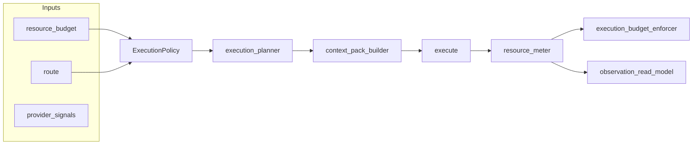

# Design: Resource policy execution stack (ai-config-os)

**Status:** Approved (human); spec-document-reviewer: three passes (see §9)  
**Date:** 2026-04-01  
**Related plan:** Cursor plan `resource-policy-stack` (local `.cursor/plans/`); key merge/branch content is mirrored in this doc.

## 1. Problem

The product needs a **personal tool layer** where optimization targets the **whole interaction stack**, not raw “make the model token-efficient.” The scarce resource differs by commercial mode:

- **API key users:** money (spend).
- **Subscription users:** usage headroom — caps, tier access, throttles, queues, opaque provider limits — not the same as dollars.

A single “cost budget” framing misleads subscription users and encourages fake precision. The runtime should implement **resource policy**: the same core decisions (tokens, latency, model tier, compaction, fallback) with **mode-specific accounting** — spend **or** usage pressure — not a universal faux currency.

## 2. Goals

- **Unified execution policy:** Every execution decision is driven by  
  `user mode + route + skill resource_budget + provider/accounting signals + fallback policy`,  
  not by ad hoc prompts or skill prose choosing models.
- **Core object:** `ExecutionPolicy = { mode, budget, planner_rules, accounting_adapter, fallback_ladder }` (exact keys and validation in Atom 1). Everything else hangs off this.
- **Hybrid rule surface:** Overflow and preference (e.g. “subscription first, API on throttle or deep research”) are **data**, not prompts: `resource_budget` / `ExecutionPolicy` carries hybrid knobs; **planner rules** and **degradation ladder** reference the same IDs. Deployment-only secrets (API keys) stay in env; **user-visible preference** lives in normalized budget + policy tables, not ad hoc UI state in planner code.
- **Accounting adapters (Atom 2):** One interface; three implementations:
  - **api_key:** estimated and actual spend from token counts × **versioned pricing profile** in config (not hard-coded in skills).
  - **subscription:** **pressure score** from observable signals (estimated tokens, premium-tier use, rolling volume, throttles, model-unavailable responses, latency spikes) — **no** pretence of exact quota or dollar equivalence.
  - **hybrid:** compute **both**; policy chooses overflow and escalation.
- **Deterministic planner (Atom 3):** Chooses weakest sufficient model, context pack ceiling, optional passes, fallback ladder — **deterministic rules and data tables**, not LLM-chosen routing.
- **Context pack builder (Atom 4):** Assembles minimum viable input from `resource_budget` + planner decision; mode-specific compaction; returns **explainability** (what was removed/compressed).
- **Telemetry (Atom 5):** Extend **existing** observation/read-model/dashboard path — **no** second telemetry system. UI speaks honestly per mode (“Resource Use”, mode toggle, pressure vs spend views).
- **Enforcement (Atom 6):** Data-driven degradation ladders per mode at the **runtime service seam**, not in prompts or UI.
- **Pilots (Atom 7):** Three paths only, each with golden tests for **subscription / api_key / hybrid**.

## 3. Non-goals

- Inferring **exact** subscription limits from providers.
- Treating subscription **pressure** as a fake currency users pay against.
- Forking skills into “subscription” vs “API” copies.
- Adding **local inference** for routing in v1.
- Replacing [`shared/contracts/resource-budget-normalize.mjs`](../../../shared/contracts/resource-budget-normalize.mjs) wholesale — **extend** via Atom 1 contracts; modes `subscription` | `api_key` | `hybrid` already exist at skill budget level.

## 4. Conceptual model

### 4.1 Modes (recap)

| Mode             | Primary signal      | Planner bias (intent)                                                                                     |
| ---------------- | ------------------- | --------------------------------------------------------------------------------------------------------- |
| **subscription** | Pressure / headroom | Minimize pressure; preserve premium tier; aggressive compaction; skip optional passes when policy says so |
| **api_key**      | Spend (minor units) | Minimize money subject to quality floor; planner knows when it crosses spend bands                        |
| **hybrid**       | Both                | User preference (e.g. subscription first, API overflow on throttle or deep research)                      |

### 4.2 Pipeline (logical)



**Enforcer** applies when policy would be exceeded or provider signals demand degradation; order is **ladder-based** (Atom 6).

**Where hybrid is configured:** Same three layers as other modes: (1) skill/registry `resource_budget` (mode `hybrid` + thresholds), (2) `ExecutionPolicy` resolved at runtime from budget + route + machine/project config, (3) `planner-rules` and `degradation-ladders` YAML keyed by policy IDs. Atom 7 facade composes these; no duplicate “hybrid logic” in MCP vs Worker.

### 4.2a Execution and enforcement semantics (v1)

**Partitioning Atoms 3, 4, 6, 7 (no duplicate “compact” logic):**

| Concern                                                 | Owner                 | Role                                                                                                                                                                                                                                                                                                                               |
| ------------------------------------------------------- | --------------------- | ---------------------------------------------------------------------------------------------------------------------------------------------------------------------------------------------------------------------------------------------------------------------------------------------------------------------------------- |
| **Plan** tier, optional passes, context ceiling         | Atom 3 (planner)      | Pure function of `ExecutionPolicy` + task class + signals + **current constraints**                                                                                                                                                                                                                                                |
| **Pack** context to a token budget                      | Atom 4 (context pack) | Pure function of planner output + task state                                                                                                                                                                                                                                                                                       |
| **Measure** spend/pressure                              | Atom 2 (meter)        | After execution (and optionally pre-exec estimates)                                                                                                                                                                                                                                                                                |
| **Choose the next ladder step** when policy is violated | Atom 6 (enforcer)     | Maps (meter output, policy) → **constraint delta** or terminal failure reason — **does not** reimplement planner rules                                                                                                                                                                                                             |
| **Loop** plan → pack → execute → meter → enforce        | Atom 7 (facade)       | Owns **bounded replan**: enforcer may return “apply ladder step _s_ and **retry**” → orchestration **re-invokes** PL → CP → EX with tightened constraints (same user request), up to **K** attempts. **Default `K`:** `3` unless overridden by `runtime/config` key documented in Atom 1 (same key used in enforcer/facade tests). |

**Single-request vs multi-turn:** Ladder steps that **change** planner inputs for the **same** request are **intra-request retries** orchestrated in Atom 7. Steps that only make sense on the **next** user message (e.g. “back off for 60s”) are **terminal outcomes** with a clear reason code; no hidden loop inside Atom 6.

**Diagram note:** The linear `EX → MTR → ENF` omits the **feedback** edge; logically `ENF -- retry with new constraints --> PL` is **Atom 7 orchestration**, not a second meter.

### 4.2b Policy resolution precedence

When building `ExecutionPolicy`, sources are merged with **deterministic precedence** (Atom 1 implements `resolveExecutionPolicy` or equivalent; Atom 7 calls it):

1. **Skill `resource_budget`** (registry / compile-time): authoritative for **mode** and skill-level knobs unless overridden below by an **explicit** project/machine key of the same name.
2. **Route / environment** (e.g. CI vs IDE): may **narrow** caps (forbid premium tier, lower max context) — **narrowing wins** over skill defaults; must not **widen** beyond the **effective skill + project + machine** merged policy for that execution (i.e. route cannot grant cheaper tiers or higher caps than that merged baseline would allow — route is only a stricter mask).
3. **Project** runtime config (`runtime/config/` merge): fills defaults and overrides **only** keys present in file.
4. **Machine / global**: lowest-priority defaults.

If two layers set conflicting **mode** values, **route wins for safety** (e.g. force `api_key`-style spend accounting in a billing-sensitive route). **All other merge pairs** (skill vs project, project vs machine, when route is silent) are defined **only** in Atom 1’s `resolveExecutionPolicy` implementation and its tests — parallel atoms must not assume ordering beyond this section; import the resolver after Atom 1 lands.

### 4.3 Normalized accounting result (contract surface)

Atom 1 fixes names and types. Implementations must populate subsets per mode. **Illustrative** field set (adjust only via Atom 1 PR):

- **Tokens:** `estimated_input_tokens`, `estimated_output_tokens`, `packed_context_tokens`, `compacted_from_tokens` (optional breakdown by stage).
- **Money (api_key / hybrid):** `estimated_cost_minor`, actual if known; currency or minor-unit convention documented in Atom 1.
- **Pressure (subscription / hybrid):** `pressure_score` in `[0, 1]` or agreed scale; **not** dollars.
- **Operational:** `throttle_detected`, `model_unavailable_detected`, `latency_spike_detected` (booleans or counts).
- **Routing:** `model_tier_selected`, `fallback_reason`, `overflow_mode_used` (e.g. which leg of hybrid fired).

All optional where not applicable; **validators** reject malformed combinations per mode.

## 5. Implementation atoms (seven PRs)

Each atom is **one branch, one PR**. Atom **1** merges first; **2–6** parallelizable against contracts; **7** integrates after **1–6**.

**Merge order vs golden tests:** Atoms **2–4** and **6** can land in any order after **1**. **Atom 5** should merge **before Atom 7** when golden or integration tests assert **telemetry/read-model/dashboard** fields; if **5** is late, **Atom 7** may ship pilot wiring with **unit/integration tests only** and add read-model assertions in a **follow-up** or wait for **5** on `main` before enabling dashboard-facing goldens. **Atom 7** always assumes **1–6** are present for full-stack behaviour.

### 5.1 Atom 1 — Contracts and normalized shapes

**Deliverables:**

- JSDoc typedefs / small runtime module for `ExecutionPolicy`, normalized accounting result, and execution observation **field list**.
- Optional JSON Schema under `schemas/` if the repo pattern supports it.
- Minimal tests: empty payloads validate; invalid shapes rejected.

**Primary paths:** e.g. `shared/contracts/resource-policy-types.mjs` (exact name in implementation PR).

### 5.2 Atom 2 — Resource meter

**Deliverables:**

- `runtime/lib/resource-meter/` (or equivalent) with factory selecting adapter by mode.
- Versioned **pricing profile** config for api_key.
- Subscription pressure from signals; hybrid returns **both** views.
- Provider-specific parsing isolated in small files (e.g. `runtime/lib/adapters/*-provider-signals.mjs`).

**Tests:** Red/green/refactor per adapter; known token counts → known spend estimates for api_key; repeated premium/throttle → pressure increases for subscription.

### 5.3 Atom 3 — Execution planner

**Deliverables:**

- `runtime/lib/execution-planner.mjs` + `runtime/config/planner-rules.yaml` (or JSON).
- Scenario tests: **same task + skill**, three **explainable** outcomes by mode (mock meter signals as needed).

**Rule:** No prompt text selects model tier.

### 5.4 Atom 4 — Context pack builder

**Deliverables:**

- `runtime/lib/context-pack-builder.mjs`, `runtime/lib/token-estimate.mjs`.
- Inputs: `resource_budget`, planner output; outputs: packed content + **breakdown** of omissions/compression.
- Tests: same large task state → different packed results per mode.

### 5.5 Atom 5 — Telemetry and UI

**Deliverables:**

- New execution observation fields (aligned with §4.3): e.g. `user_mode`, `estimated_*`, `packed_context_tokens`, `compacted_from_tokens`, `estimated_cost_minor`, `pressure_score`, `model_tier_selected`, `throttle_detected`, `fallback_reason`, `overflow_mode_used`.
- Aggregation in read model (new helper file + thin glue in [`runtime/lib/observation-read-model.mjs`](../../../runtime/lib/observation-read-model.mjs)).
- Dashboard: rename or dual label (“Resource Use”), mode toggle; subscription vs api_key vs hybrid slices per product copy.
- Contract tests: **backward compatible** for existing consumers — defined as **additive optional fields only** on existing event/API shapes; **no renaming or removing** keys that dashboard or MCP clients already read; new fields may default to `null`/omitted until events populate them.

### 5.6 Atom 6 — Execution budget enforcer

**Deliverables:**

- `runtime/lib/execution-budget-enforcer.mjs` + `runtime/config/degradation-ladders.yaml`.
- Ladders (intent):
  - **subscription:** compact harder → skip optional passes → downshift tier if allowed → backoff on throttle → hybrid API overflow if configured → fail with reason.
  - **api_key:** compact → downshift cheaper tier → reduce output budget → skip optional passes → fail on spend cap breach.
  - **hybrid:** explicit policy order (e.g. subscription first, API for defined triggers).

**Tests:** Deterministic ladder scenarios per mode.

### 5.7 Atom 7 — Integration and pilots

**Deliverables:**

- Facade (e.g. `runtime/lib/execution-policy-compose.mjs`) wiring policy composition from config + registry skill `resource_budget`.
- **Three pilots only** (concrete anchors — adjust only if repo layout changes):
  1. **Context budget:** skill [`shared/skills/context-budget/SKILL.md`](../../../shared/skills/context-budget/SKILL.md), MCP/executor `context_cost`, Worker dashboard `runtime.context_cost`, Worker skill route `/v1/skill/context-budget` (existing `resource_budget` contract tests).
  2. **Structured task journey:** [`runtime/lib/task-control-plane-service.mjs`](../../../runtime/lib/task-control-plane-service.mjs) / [`task-control-plane-service-worker.mjs`](../../../runtime/lib/task-control-plane-service-worker.mjs) and Worker task runtime wiring — persisted task state path already centralised.
  3. **Research-style skill:** [`shared/skills/autoresearch/SKILL.md`](../../../shared/skills/autoresearch/SKILL.md) (and related Worker analytics routes if events must flow there) — mode differences (tier, length) are material.
- Golden tests per pilot × three modes; short **before/after** in PR description.

## 6. File ownership (conflict firewall)

| Atom | Owns primarily                                                                           |
| ---- | ---------------------------------------------------------------------------------------- |
| 1    | Shared types/schemas; minimal normalize extend                                           |
| 2    | `runtime/lib/resource-meter/**`, pricing config, provider signal adapters                |
| 3    | `execution-planner.mjs`, planner rules data                                              |
| 4    | `context-pack-builder.mjs`, `token-estimate.mjs`                                         |
| 5    | observation sources + read-model extension + dashboard + Worker dashboard if API changes |
| 6    | `execution-budget-enforcer.mjs`, degradation ladders data                                |
| 7    | Facade + wire points + golden tests                                                      |

## 7. Verification

Per [`AGENTS.md`](../../../AGENTS.md): `node scripts/build/compile.mjs`, `npm test`, touched-surface checks; `bash ops/pre-pr-mergeability-gate.sh` before merge. Atom-specific tests colocated or under `scripts/build/test/` as per repo convention.

## 8. References

- Hillman, T. (2026). _AI Config OS_ [GitHub repository]. `https://github.com/thomashillman/ai-config-os`
- [`PLAN.md`](../../../PLAN.md), [`README.md`](../../../README.md), [`docs/SUPPORTED_TODAY.md`](../../SUPPORTED_TODAY.md)
- [`runtime/lib/observation-read-model.mjs`](../../../runtime/lib/observation-read-model.mjs)
- [`runtime/lib/resource-budget-for-skill.mjs`](../../../runtime/lib/resource-budget-for-skill.mjs)

## 9. Spec review log (spec-document-reviewer)

| Pass  | Outcome                           | Follow-up                                                                                                                                                                               |
| ----- | --------------------------------- | --------------------------------------------------------------------------------------------------------------------------------------------------------------------------------------- |
| **1** | **Approved** (no blocking issues) | Advisory: hybrid config surface, PR title consistency, concrete pilots, backward-compat definition — incorporated into §2, §4, §5, Appendix A.                                          |
| **2** | **Issues Found**                  | Enforcer/planner partition, policy precedence, Atom 5/7 merge hazard — addressed by §4.2a, §4.2b, §5 merge note, Appendix A orchestration.                                              |
| **3** | **Issues Found**                  | Appendix A vs §5 (Atom 5/7 goldens); “user policy” wording in §4.2b — addressed by orchestration step 4, §4.2b route wording + non-route pairs in Atom 1 tests; **K** default in §4.2a. |

**After pass 3:** remaining subagent findings were **resolved in-repo**; no fourth pass required per “up to three iterations.” Human approval is the next gate.

---

## Appendix A — Parallel subagents (execution playbook)

**Use after this spec is approved.** One **Task** `generalPurpose` session per atom; do not multi-scope. **Land Atom 1 on `main` first**; rebase `feat/resource-policy-atom-0N-*` before opening PRs for N ∈ {2,…,6}. Atom 7 after **1–6** merged.

**HARD-GATE:** No implementation subagents until design approval (human + optional spec-document-reviewer per superpowers brainstorming).

**Orchestration:**

1. Land Atom 1 first; contracts are the merge base for parallel branches.
2. Rebase feature branches onto latest `main` after Atom 1 merges.
3. Launch subagents 2–6 in parallel only when all use **this committed spec** for field names and `ExecutionPolicy` shape. If the spec changes, pause; contract fixes → Atom 1 follow-up PR.
4. **Atom 5 before Atom 7** if PR **7** includes read-model or dashboard **golden** assertions; if **5** is not yet on `main`, scope Atom 7 to wiring + unit/integration tests and defer dashboard goldens or add a follow-up PR (same rule as §5 opening).
5. Atom 7 after **1–6** are merged (prefer full `main` for golden tests).

**Subagent tool:** Task with `subagent_type: generalPurpose` (implementation) or `explore` (read-only survey).

### Shared preamble (prepend to every atom prompt)

```text
Repository: ai-config-os. Follow AGENTS.md verification commands for touched surfaces.
Conventional Commits (required form): feat(resource-policy): atom N — <short title>
  Example: feat(resource-policy): atom 2 — resource meter adapters
Branch: feat/resource-policy-atom-0N-<slug> (create from latest main after Atom 1 contracts are merged).
Only edit files listed under “Allowed paths”. Do not refactor unrelated code.
Run npm test (or targeted tests) and ops/pre-pr-mergeability-gate.sh before reporting done.
```

### Subagent brief — Atom 1 (contracts)

**Mission:** Introduce shared types, normalized accounting result shape, `ExecutionPolicy` object, optional execution-observation field stubs, and minimal validation tests. No meter/planner/enforcer logic.

**Allowed paths:** `shared/contracts/resource-policy-types.mjs` (or agreed path), optional `schemas/`, tests under `scripts/build/test/` or colocated `*.test.mjs`, and **only** surgical edits to `shared/contracts/resource-budget-normalize.mjs` if the spec requires new compile-time fields.

**Forbidden:** `runtime/lib/resource-meter/**`, `execution-planner.mjs`, `observation-read-model.mjs` body rewrites (stubs elsewhere only if Atom 1 owns a new file).

**Done when:** Empty/minimal payloads validate; PR title: `feat(resource-policy): atom 1 — contracts and normalized shapes`.

### Subagent brief — Atom 2 (resource meter)

**Mission:** Implement three accounting adapters (subscription pressure, api_key spend from versioned pricing config, hybrid both) behind one interface; provider signal parsing in small files; TDD red/green/refactor.

**Precondition:** Atom 1 merged.

**Allowed paths:** `runtime/lib/resource-meter/**`, `runtime/config/pricing-profile.*`, `runtime/lib/adapters/*-provider-signals.mjs`, tests for this atom only.

**Forbidden:** planner, context-pack-builder, enforcer, dashboard UI.

**Done when:** Tests show estimates vs observed + normalized result per mode; PR title: `feat(resource-policy): atom 2 — resource meter adapters`.

### Subagent brief — Atom 3 (execution planner)

**Mission:** Deterministic `execution-planner.mjs` + data-driven `planner-rules.yaml`; mode-specific scenario tests (same task → three explainable outcomes); **no** prompts choose model tier.

**Precondition:** Atom 1 merged.

**Allowed paths:** `runtime/lib/execution-planner.mjs`, `runtime/config/planner-rules.yaml`, tests. Mock meter/future signals in tests.

**Forbidden:** resource-meter implementation files, observation-read-model, React dashboard.

**Done when:** Scenario tests pass; PR title: `feat(resource-policy): atom 3 — execution planner`.

### Subagent brief — Atom 4 (context pack builder)

**Mission:** `context-pack-builder.mjs` + `token-estimate.mjs`; mode-specific compaction; return structured breakdown of removals/omissions; tests: same large state → different packs per mode.

**Precondition:** Atom 1 merged.

**Allowed paths:** `runtime/lib/context-pack-builder.mjs`, `runtime/lib/token-estimate.mjs`, tests.

**Forbidden:** pricing profile, planner internals (import planner **output types** from Atom 1 only), telemetry.

**Done when:** Breakdown fields stable for debugging; PR title: `feat(resource-policy): atom 4 — context pack builder`.

### Subagent brief — Atom 5 (telemetry + UI)

**Mission:** Extend observation events and read model with execution resource fields; **one** pipeline; dashboard copy (“Resource Use” / mode toggle); backward-compatible API contract tests; aggregation logic in read model not React.

**Precondition:** Atom 1 merged (field names fixed).

**Allowed paths:** `runtime/lib/observation-event.mjs` (or equivalent), **new** `runtime/lib/observation-sources/execution-resource.mjs`, thin glue in `observation-read-model.mjs`, `dashboard-analytics-contracts.mjs`, dashboard components, Worker dashboard handlers **only** if required for contract—keep tests beside.

**Forbidden:** Implementing meter/planner/enforcer logic here—only consume shapes.

**Done when:** New fields appear in read model + tests; PR title: `feat(resource-policy): atom 5 — telemetry and UI`.

### Subagent brief — Atom 6 (budget enforcer)

**Mission:** `execution-budget-enforcer.mjs` + data-driven `degradation-ladders.yaml`; mode-specific ladders; explicit failure reasons; ladder tests.

**Precondition:** Atom 1 merged.

**Allowed paths:** `runtime/lib/execution-budget-enforcer.mjs`, `runtime/config/degradation-ladders.yaml`, tests.

**Forbidden:** skill prose, UI, MCP handlers.

**Done when:** Deterministic ladder tests for subscription / api_key / hybrid; PR title: `feat(resource-policy): atom 6 — budget enforcer`.

### Subagent brief — Atom 7 (integration + pilots)

**Mission:** `execution-policy-compose.mjs` (or facade); wire **three** pilots only—context_cost/context-budget path, one structured persisted task journey, one research-style skill; golden tests for **three modes** each; document before/after.

**Precondition:** Atoms 1–6 merged into `main`; rebase branch before work.

**Allowed paths:** facade + wire points only; golden/integration tests; **minimal** edits to existing handlers to call facade.

**Forbidden:** Reimplementing internals of atoms 2–6; expanding scope beyond three pilots.

**Done when:** `npm test` + mergeability gate green; PR title: `feat(resource-policy): atom 7 — integration and pilots`.

---

## Appendix B — Implementation plan

**Writing-plans output:** [`docs/superpowers/plans/2026-04-01-resource-policy-implementation.md`](../plans/2026-04-01-resource-policy-implementation.md) (checklists per atom, verification ladder).

Execute PRs in dependency order; use Appendix A subagent briefs with that plan.
