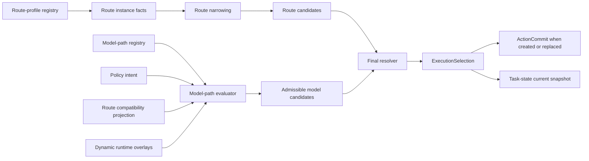

# Design: Routing policy plus model-path selection (ai-config-os)

**Status:** Proposed  
**Date:** 2026-04-04  
**Related plan:** [`docs/superpowers/plans/2026-04-04-routing-policy-model-path-selection-implementation.md`](../plans/2026-04-04-routing-policy-model-path-selection-implementation.md)  
**Related specs:**

- [`docs/superpowers/specs/2026-04-03-authoritative-task-command-store-design.md`](2026-04-03-authoritative-task-command-store-design.md)
- [`docs/superpowers/specs/2026-04-01-resource-policy-execution-stack-design.md`](2026-04-01-resource-policy-execution-stack-design.md)

## 1. Problem

ai-config-os already contains route-aware task flows and a resource-policy execution stack, but it does not yet define one canonical policy contract that chooses both the execution surface and the concrete model path as one explainable decision.

That gap creates several risks:

- route choice and model choice can drift apart
- receipts can show what happened without clearly showing why
- current runtime code can grow hidden policy behaviour across handlers, evaluators, and fallback paths
- future multi-user enterprise evolution becomes harder because execution truth is not stamped in one stable, inspectable shape

This design introduces one explicit policy system for:

- evaluating route candidates
- evaluating model-path candidates
- joining those candidates into one final `ExecutionSelection`
- stamping that final selection into authoritative task history without turning the receipt into a full evaluation trace

## 2. Goals

- **One combined execution decision:** Route selection and model-path selection must end in one combined `ExecutionSelection`, not two loosely related decisions.
- **Layered policy:** Route evaluator, model-path evaluator, and final resolver stay separate in implementation, but contract-level truth is unified.
- **Stable contracts:** Static route truth and static model-path truth live in canonical registries that are versioned, declarative, and validated.
- **Evidence-driven route handling:** Route identity stays static; contextual narrowing only affects agreed capability fields.
- **Cheapest valid pair:** Final selection uses hard constraints first, minimum quality and reliability floors second, cheapest valid route-plus-model pair third.
- **Explainable receipts:** Authoritative receipts record final selection truth, not a hidden evaluation dump.
- **Enterprise-shaped now:** Single-user runtime remains simple today, but the stamped selection contract and versioning model are ready for future enterprise operation.

## 3. Non-goals

- building a weighted scoring engine
- storing full rejected-candidate traces in authoritative receipts
- allowing contextual narrowing to mutate route identity or static limits
- putting live runtime conditions into static registries
- using raw hashes, commit SHAs, or provider internals as the core versioning scheme
- treating diagnostics as canonical execution truth

## 4. Conceptual model

### 4.1 High-level pipeline

### 4.2 Design rule

At the **contract and receipt** level, route and model-path selection are one decision. At the **implementation** level, they remain modular:

- one route evaluator
- one model-path evaluator
- one final resolver

### 4.3 Selection policy rule

The resolver follows this order:

1. authority, data, and boundary constraints
2. route capability and locality constraints
3. minimum quality floor
4. minimum reliability floor
5. cheapest valid route-plus-model pair
6. tie-break order when cost ties remain:
   - higher evidence depth
   - stronger reliability margin
   - lower latency risk
   - fixed deterministic config order

No weighted blended score is used.

## 5. Route contract

### 5.1 v1 route set

The formal v1 route contract contains:

- `local_repo`
- `github_pr`
- `uploaded_bundle`
- `pasted_diff`

`pasted_diff` remains in the formal contract, but is explicitly modelled as a lower-capability, partial-artifact route.

### 5.2 Route kind

`route_kind` is a small family enum:

- `repository_local`
- `repository_remote`
- `artifact_bundle`
- `artifact_diff`

Guardrail:
`route_kind` is a family field only. It must not absorb automation class, delegation mode, operating mode, or trust posture.

### 5.3 Canonical route-profile registry

Use one versioned, declarative route-profile registry as the canonical home for static default route profiles.

Canonical entry shape:

- `identity`
  - `route_id`
  - `route_kind`
- `default_capabilities`
  - `artifact_completeness`
  - `history_availability`
  - `locality_confidence`
  - `verification_ceiling`
  - `allowed_task_classes`
- `static_limits`
  - `max_input_tokens`
  - `max_output_tokens`
  - `max_total_tokens`
  - `max_latency_ms`
  - `minimum_model_tier`
- `static_preferences`
  - `preferred_model_tier`

Guardrails:

- only `default_capabilities` may be contextually narrowed
- `static_limits` and `static_preferences` must not be contextually narrowed
- `static_preferences` are not fallback logic and not resolver tie-break logic
- the registry must stay declarative and boring
- the registry does not own contextual narrowing, policy overlay, fallback logic, or final resolution

### 5.4 Default capability enums

#### `artifact_completeness`

- `repo_complete`
- `repo_partial`
- `artifact_complete`
- `diff_only`

#### `history_availability`

- `repo_history`
- `change_history`
- `artifact_limited_history`
- `no_history`

#### `locality_confidence`

- `repo_local`
- `repo_remote_bound`
- `artifact_scoped`
- `diff_scoped`

#### `verification_ceiling`

- `full_artifact_verification`
- `partial_artifact_verification`
- `diff_only_verification`

Guardrail:
Keep `verification_ceiling` small and concrete. It must not grow into a broad trust taxonomy.

#### `allowed_task_classes`

- `repository_review`
- `patch_review`
- `artifact_review`

Guardrail:
Keep task classes small, concrete, and tied to observable work shapes.

## 6. Route instance facts and narrowing

### 6.1 Canonical route instance facts

Use a small evidence-only facts object:

- `route_id`
- `route_kind`
- `artifact_surface`
- `history_surface`
- `repository_binding`
- `task_shape_evidence`

Guardrails:

- facts remain observational, not policy-shaped
- the facts contract and the narrowing function are separately validated
- facts must not collapse into the final capability enums

### 6.2 Facts field value shape

#### `artifact_surface`

- `repo_tree_full`
- `repo_tree_partial`
- `artifact_bundle`
- `diff_only`

#### `history_surface`

- `repo_history_visible`
- `change_history_visible`
- `artifact_history_visible`
- `history_not_visible`

#### `repository_binding`

- `local_repo_bound`
- `remote_repo_bound`
- `artifact_bound`
- `diff_unbound`

#### `task_shape_evidence`

A bounded ordered set of closed-vocabulary observational markers.

Initial marker vocabulary:

- `multi_file_change_observed`
- `directory_context_observed`
- `build_manifest_observed`
- `test_artifacts_observed`
- `patch_shape_observed`

Guardrails:

- vocabulary is closed and small
- canonical ordering is required
- duplicates are forbidden
- hard max size is **5** in v1, with **4** as the normal target
- markers must be positive observational facts, not policy conclusions
- markers must not restate what another field already says

### 6.3 Narrowing flow

Route narrowing is a two-step pipeline:

1. `deriveRouteInstanceFacts(raw_surface_input) -> route_instance_facts`
2. `deriveEffectiveRouteCapabilities(route_profile, route_instance_facts) -> effective_capabilities`

The narrowing function is pure, deterministic, and monotonic.

It may only narrow or preserve:

- `artifact_completeness`
- `history_availability`
- `locality_confidence`
- `verification_ceiling`
- `allowed_task_classes`

It must never widen, change route identity, invent new capability fields, or access live runtime state.

## 7. Model-path contract

### 7.1 Canonical model-path registry

Use one versioned, declarative model-path registry as the canonical home for stable path descriptors and stable policy-class metadata.

The canonical artifact is the **expanded concrete registry**, not the template source.

Canonical entry shape:

- `identity`
  - `provider`
  - `model_id`
- `compatibility`
  - `supported_execution_modes`
- `policy_classes`
  - `model_tier`
  - `cost_basis`
  - `reliability_margin`
  - `latency_risk`

Guardrails:

- registry contains only stable path descriptors and stable policy-class metadata
- dynamic conditions stay out
- the registry stays declarative and boring
- if a field is only useful because of live state, it does not belong in the registry
- shared templates may exist only as data-only authoring convenience and must expand before validation

### 7.2 Resolved model path

The final concrete `resolved_model_path` shape is:

- `provider`
- `model_id`
- `model_tier`
- `execution_mode`

Keep adapter ids, overflow details, and pricing-profile references out of the core contract.

### 7.3 Pre-join model candidate shape

Each admissible model-path candidate contains only intrinsic pre-join fields:

- `provider`
- `model_id`
- `model_tier`
- `execution_mode`
- `cost_basis`
- `reliability_margin`
- `latency_risk`

Candidate contracts must remain resolver inputs, not diagnostic objects.

### 7.4 Model candidate policy-class enums

#### `cost_basis`

- `cost_efficient`
- `cost_balanced`
- `cost_heavy`

#### `reliability_margin`

- `meets_floor`
- `above_floor`
- `high_margin`

#### `latency_risk`

- `interactive_safe`
- `interactive_tolerable`
- `background_biased`

Guardrail:
These are ordered policy classes, not arithmetic values. No hidden numeric mapping in the resolver.

## 8. Model-path evaluator

### 8.1 Input envelope

The evaluator consumes one typed input envelope with four sections:

- `registry_snapshot`
  - expanded concrete model-path registry at `model_policy_version`
- `policy_intent`
  - `quality_tier`
  - `reliability_tier`
  - `latency_posture`
  - `cost_posture`
- `route_compatibility_projection`
  - `allowed_execution_modes`
  - `minimum_model_tier`
  - `preferred_model_tier`
- `dynamic_runtime_overlays`
  - `availability_state`
  - `live_cost_pressure_class`
  - `overflow_posture`
  - `temporary_policy_suppressions`

Guardrail:
The evaluator does not receive route token ceilings, broad route constraints, or final pair-cost data.

### 8.2 Admissible frontier rule

The evaluator emits at most **3** admissible candidates.

Rules:

- cap enforced before final resolver runs
- deterministic ordering
- every emitted candidate already satisfies hard constraints and minimum floors
- rejected candidates are never emitted
- rationale stays compact and structured, not prose

### 8.3 Frontier construction

Use a bounded non-dominated frontier over exactly three dimensions:

- `cost_basis`
- `reliability_margin`
- `latency_risk`

No other dimensions belong in dominance testing.

Then select up to 3 representatives with deterministic ordering:

1. cheapest admissible candidate
2. strongest reliability-margin candidate from the remaining non-dominated set
3. lowest latency-risk candidate from the remaining non-dominated set
4. fixed config order as final tie-break

## 9. Final resolver

### 9.1 Join algorithm

The resolver:

1. forms compatible route-plus-model pairs
2. drops any pair failing hard constraints or minimum quality and reliability floors
3. derives `pair_cost_class` deterministically from:
   - model candidate `cost_basis`
   - route effective `artifact_completeness`
   - route effective `history_availability`
   - whether the route is effectively `diff_only` or broader in scope
4. chooses the cheapest valid pair
5. breaks ties by:
   - higher evidence depth
   - stronger reliability margin
   - lower latency risk
   - fixed deterministic config order

Guardrail:
Pair-cost derivation must be monotonic with respect to route broadness unless a documented exception exists.

### 9.2 Fallback generation

Fallback is derived **after** primary pair selection.

Route-preserving fallback is default.
Cross-route fallback is exceptional, explicit, and predeclared by policy.
It is allowed only when another execution surface is an approved substitute for the task class and evidence shape.

If fallback crosses route, the original `selected_route` remains the primary choice in the receipt, and the eligible cross-route step appears explicitly in `fallback_chain`.

## 10. ExecutionSelection contract

### 10.1 Core shape

`ExecutionSelection` contains:

- `selected_route`
- `resolved_model_path`
- `fallback_chain`
- `policy_version`
- `selection_basis`
- `selection_reason`

Guardrail:
`ExecutionSelection` is the stamped final truth, not a full evaluation trace.

### 10.2 `selected_route`

`selected_route` contains:

- `route_id`
- `route_kind`
- `effective_capabilities`

`effective_capabilities` contains only:

- `artifact_completeness`
- `history_availability`
- `locality_confidence`
- `verification_ceiling`
- `allowed_task_classes`

### 10.3 `fallback_chain`

`fallback_chain` means the ordered eligible fallback path for the chosen selection, not runtime-attempted history.

Each fallback entry contains:

- `route_id`
- `route_kind`
- `resolved_model_path`
- `fallback_reason_class`

`fallback_reason_class` enum:

- `model_unavailable`
- `route_unavailable`
- `constraint_narrowing`
- `policy_degradation`

Guardrails:

- small fixed enum only
- no timestamps
- no retry counts
- no free text
- no runtime failure detail

### 10.4 `selection_basis`

Compact structured object with:

- `constraints_passed`
- `route_admissible`
- `quality_floor_met`
- `reliability_floor_met`
- `quality_posture`
- `reliability_posture`
- `latency_posture`
- `cost_posture`
- `fallback_used`

Guardrail:
`selection_basis` must stay compact and decision-oriented. It must not contain candidate counts, rejection lists, or open-ended prose.

### 10.5 `selection_reason`

Short fixed-template summary generated from structured fields only.

Guardrail:
It is derived, not authored. If it ever disagrees with the structured fields, the structured fields win.

## 11. Identity, revision, and digest

### 11.1 Schema version

`execution_selection_schema_version` is separate from `policy_version`.
It uses major-only semantic versions such as `v1`.
It is part of canonical identity.

### 11.2 Canonical identity boundary

A new `selection_revision` and `selection_digest` are created when any of these changes:

- `selected_route`
- `resolved_model_path`
- `fallback_chain`
- `policy_version`
- `selected_route.effective_capabilities`
- `execution_selection_schema_version`

Derived fields do not trigger identity changes:

- `selection_basis`
- `selection_reason`

### 11.3 Canonical identity projection

`selection_digest` is computed from a canonical identity projection of `ExecutionSelection`, not from the full object and not from handwritten field selection at call sites.

The projection includes only canonical identity fields, including `execution_selection_schema_version`, and excludes all derived, diagnostic, and runtime fields.

The same projection defines revision-change detection.

## 12. Embedding and storage

### 12.1 Authoritative model

Store the full `ExecutionSelection` in `ActionCommit` only when an action creates or replaces the effective selection.

Store the latest effective `ExecutionSelection` in task state as a convenience snapshot.

On an explicit allow-list of actions whose contract depends on the active selection but does not replace it, store only:

- `selection_revision`
- `selection_digest`

The task-state snapshot is convenience state, not canonical historical truth.

### 12.2 Diagnostic selection context

Do not persist the admissible frontier by default.

Allow explicit, opt-in, bounded, structured diagnostic capture outside the authoritative receipt.

Use a clearly non-canonical object such as:

`execution_selection_diagnostic_context`
with:

- `task_id`
- `selection_revision`
- `capture_reason`
- `route_candidate_summaries`
- `model_candidate_summaries`
- `selected_pair_summary`

Store it only in a segregated debug or observation sink with TTL.

Guardrails:

- default off
- explicit capture intent required at emission time
- never copied into `ActionCommit`
- never required to interpret final `ExecutionSelection`
- safe to discard
- no rejected candidates
- no prose
- no runtime failure detail

## 13. Versioning and compatibility

Keep four separate major-only semantic version fields:

- `route_contract_version`
- `model_policy_version`
- `resolver_version`
- `execution_selection_schema_version`

Bump rules:

- `route_contract_version`: when route registry or route facts contract meaning changes
- `model_policy_version`: when model registry or model policy-class contract meaning changes
- `resolver_version`: when join, tie-break, cross-route fallback, or pair-cost derivation semantics change
- `execution_selection_schema_version`: when stamped `ExecutionSelection` structure or meaning changes

Optional operational tracing may use a non-canonical `policy_release_label`, but that label is outside canonical identity.

## 14. Verification requirements

At minimum, implementation must include:

- registry validation tests for route and model registries
- route instance facts contract tests
- narrowing fixture tests proving monotonic narrowing only
- model evaluator tests proving bounded admissible frontier construction
- resolver tests proving cheapest-valid-pair semantics and tie-break order
- identity projection tests proving digest stability and revision trigger correctness
- diagnostics tests proving diagnostic capture stays segregated and discardable

## 15. Design review summary

This design deliberately chooses:

- one combined execution decision at the contract level
- modular evaluators at the implementation level
- declarative registries for stable truth
- explicit narrowing boundaries
- deterministic selection without weighted scoring
- canonical receipts without hidden evaluation traces

That is the smallest design that is still strong enough for future enterprise-grade execution truth.
